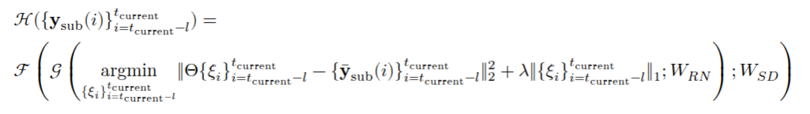
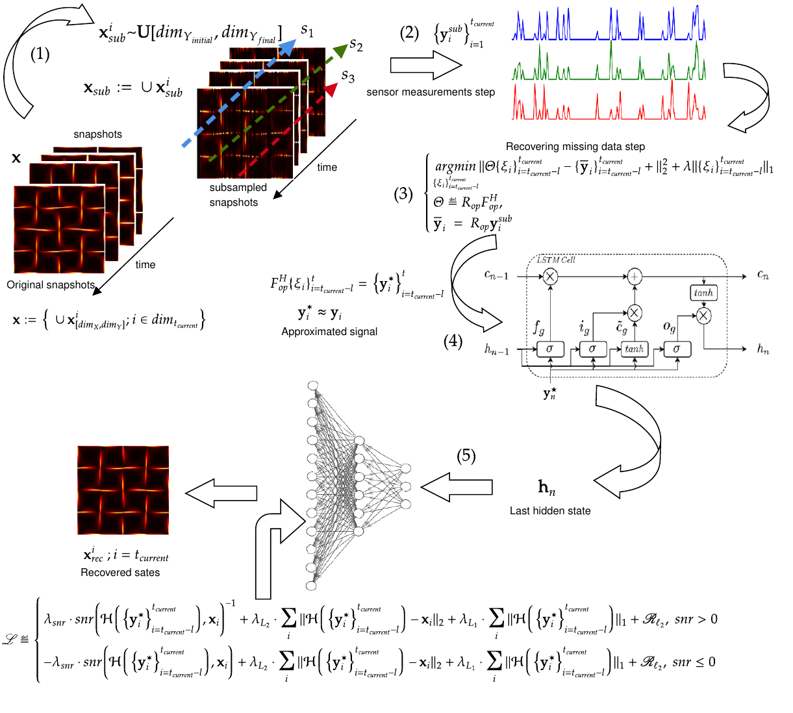

# CS-SHRED: Enhancing SHRED for Robust Recovery of Spatiotemporal Dynamics

[](https://creativecommons.org/licenses/by/4.0/)
[](https://arxiv.org/abs/2407.xxxxx)


## Project Overview

CS-SHRED is a deep learning architecture that integrates Compressed Sensing (CS) into the Shallow Recurrent Decoder (SHRED) framework to robustly reconstruct spatiotemporal dynamics from incomplete, compressed, or corrupted data. The method is designed to address the challenges of sparse sensor placements, noisy measurements, and incomplete sensor acquisitions, which are common in real-world scientific and engineering applications.
CS-SHRED introduces two key innovations:
- Incorporation of CS techniques into the SHRED architecture, leveraging a batch-based forward framework with $\ell_1$ regularization to recover signals under adverse conditions.
- An adaptive loss function that dynamically combines Mean Squared Error (MSE), Mean Absolute Error (MAE), and a piecewise Signal-to-Noise Ratio (SNR) regularization, suppressing noise and outliers in low-SNR regions while preserving fine-scale features in high-SNR regions.

## Scientific Motivation

Many scientific and engineering fields require the reconstruction of complex spatiotemporal fields (such as fluid flows, climate data, or medical images) from limited or incomplete sensor measurements. Traditional methods often fail when data is missing, corrupted, or sparsely sampled. CS-SHRED is designed to:
- Reconstruct full spatiotemporal fields from sparse, irregular, or noisy sensor data.
- Provide reliable results even when traditional methods fail due to data loss or corruption.
- Support applications in environmental monitoring, climate science, engineering, and medical imaging.
- 
## Simulating Real-World Corrupted or Missing Data

A key step in the CS-SHRED pipeline is the simulation of corrupted or missing data, which mimics real-world scenarios where sensor failures, noise, or transmission losses occur. This is mathematically achieved by applying a restriction operator to the original spatiotemporal field, masking (zeroing) selected spatial and temporal locations to emulate missing or corrupted measurements.
**Mathematical formulation (Restriction/Subsampling Operator):**

$$
x_{sub}(x, y, t) =
\begin{cases}
0 & \text{if } y \in Y_{sub} \text{ and } t \in T_{sub} \\
x(x, y, t) & \text{otherwise}
\end{cases}
$$

where:
- $x_{sub}(x, y, t)$ is the subsampled (corrupted) field,
- $x(x, y, t)$ is the original spatiotemporal field,
- $Y_{sub}$ is the set of spatial locations (columns) selected for subsampling,
- $T_{sub}$ is the set of time snapshots selected for subsampling.
This mathematical subsampling step is essential for evaluating the robustness and practical applicability of CS-SHRED in real-world environments where data is often incomplete or corrupted.

## CS-SHRED Architecture and Mathematical Formulation

CS-SHRED extends the SHRED model by integrating a compressed sensing recovery step before the LSTM and decoder. The pipeline consists of:
1. **Data Subsampling:** Randomly remove a percentage of spatial columns and time snapshots to simulate missing or corrupted sensor data.
2. **Compressed Sensing Recovery:** For each batch, solve a convex optimization problem to recover missing values. This uses a restriction operator and the Hermitian of the Fourier transform. The recovery step is:

$$
\arg\min_{\{\xi_i\}} \| \Theta \{\xi_i\} - \{y_{sub}(i)\} \|_2^2 + \lambda \| \{\xi_i\} \|_1
$$

where:
- $\Theta$ is the composition of the restriction operator and the Hermitian of the Fourier transform,
- $\{y_{sub}(i)\}$ are the observed (nonzero) sensor values,
- $\lambda$ is the sparsity regularization parameter.
3. **LSTM Sequence Modeling:** The recovered time series from sensors is processed by LSTM layers to capture temporal dependencies.
4. **Shallow Decoder:** The LSTM output is mapped to the high-dimensional state space using a shallow fully connected network.
5. **Adaptive Loss Function:** Training uses a loss that combines mean squared error, mean absolute error, and a signal-to-noise ratio (SNR) penalty, with regularization to promote robustness and sparsity.

### CS-SHRED Model Equation


*Figure: Visual representation of the main CS-SHRED model equation, showing the end-to-end mapping from subsampled sensor data to reconstructed state through compressed sensing recovery, LSTM modeling, and shallow decoding.*
where:
- $\mathcal{H}$ is the full CS-SHRED mapping from subsampled sensor data to reconstructed state.
- $\mathcal{F}$ is the shallow decoder (fully connected network) with weights $W_{SD}$.
- $\mathcal{G}$ is the LSTM network with weights $W_{RN}$.
- The inner minimization is the compressed sensing recovery step.
- $\{y_{sub}(i)\}$ are the subsampled sensor measurements over the lag window.
- $\Theta$ is the composition of the restriction operator and the Hermitian of the Fourier transform.
- $\lambda$ is the sparsity regularization parameter.
This equation formalizes the end-to-end process: from corrupted sensor data, through compressed sensing recovery, temporal modeling, and final high-dimensional reconstruction.

### Adaptive Loss Function

$$
\mathcal{L} =
\begin{cases}
    \lambda_{snr} \cdot SNR^{-1} + \lambda_{L2} \cdot MSE + \lambda_{L1} \cdot MAE + R_{l2}, & SNR > 0 \\
    -\lambda_{snr} \cdot SNR + \lambda_{L2} \cdot MSE + \lambda_{L1} \cdot MAE + R_{l2}, & SNR \leq 0
\end{cases}
$$

where:
- $MSE$ is the mean squared error
- $MAE$ is the mean absolute error
- $SNR$ is the signal-to-noise ratio
- $R_{l2}$ is an $l_2$ regularization term
- $\lambda_{snr}$, $\lambda_{L2}$, $\lambda_{L1}$ are hyperparameters controlling the contribution of each term

### CS-SHRED Pipeline Diagram


*Figure: Overview of the CS-SHRED pipeline. The original dynamics are subsampled, sensor time series are recovered via convex optimization, and the LSTM-decoder reconstructs the full field.*

## Datasets and Scientific Context

CS-SHRED was validated on four diverse datasets, each representing a challenging spatiotemporal reconstruction problem:

### Viscoelastic Flow (Oldroyd-B Model)
We employ numerical simulation data from the Oldroyd-B constitutive model [Oishi et al., 2024], which describes the dynamics of non-Newtonian viscoelastic fluids. This dataset focuses on the trace of the conformation tensor, $\text{Tr}(\mathbf{C})$, a critical indicator of the fluid's elastic stress state. Given its complex nonlinear dynamics and multiple spatial and temporal scales, accurately reconstructing $\text{Tr}(\mathbf{C})$ from sparse and incomplete sensor measurements provides a rigorous test of our model's capability to capture both elastic and viscous features.

### Rotating Turbulent Flow (TURB-Rot)
The rotating turbulent flow dataset from the TURB-Rot database [Biferale et al., 2020] represents a particularly challenging scenario. Simulated on a $256^3$ grid within a triply periodic domain, the dataset encompasses a wide range of turbulent scales. By applying controlled subsampling---removing 30% of spatial columns in 30% of temporal snapshots---this dataset emulates realistic measurement constraints. Our results demonstrate that **CS-SHRED** is highly effective in reconstructing fine spatial details and dynamic behaviors, outperforming the conventional **SHRED** model, particularly in preserving temporal consistency and spatial fidelity.

### Sea Surface Temperature (SST)
The SST dataset, available at [NOAA OISST v2](https://psl.noaa.gov/thredds/catalog/Datasets/noaa.oisst.v2/catalog.html?dataset=Datasets/noaa.oisst.v2/sst.wkmean.1990-present.nc), comprises measurements of the ocean's surface temperature---critical for understanding climate patterns, ocean currents, and weather forecasting. Due to frequent gaps caused by cloud cover and satellite limitations, SST provides an ideal testbed for our model's ability to reconstruct incomplete and noisy data.

### Maximum Specific Humidity (qmax)
Accessible at [NOAA 20th Century Reanalysis](https://psl.noaa.gov/thredds/catalog/Datasets/20thC_ReanV3/Derived/8XDailies/2mMO/catalog.html?dataset=Datasets/20thC_ReanV3/Derived/8XDailies/2mMO/qmax.2m.8Xday.ltm.nc), the qmax dataset contains measurements of the maximum specific humidity, a key variable for analyzing moisture distribution and atmospheric processes. Its inherent incompleteness and irregular sampling challenge our model to accurately reconstruct the underlying spatiotemporal patterns.

Each dataset presents unique challenges, such as high-dimensionality, strong nonlinearity, and severe data loss, providing comprehensive validation of CS-SHRED's robustness across diverse scientific domains.

## Experimental Results: CS-SHRED vs SHRED

The following tables summarize the quantitative results comparing CS-SHRED and SHRED across all datasets. Metrics include Normalized Error (lower is better), SSIM (higher is better), PSNR (higher is better), and LPIPS (lower is better).

### Sea Surface Temperature (SST) Metrics

| Metric                     | CS-SHRED | SHRED  | Ideal Value      |
| -------------------------- | -------- | ------ | ---------------- |
| Metrics (Lower is Better)  |          |        |                  |
| Normalized Error           | 0.1589   | 0.1709 | 0                |
| LPIPS                      | 0.2472   | 0.2586 | 0                |
| Metrics (Higher is Better) |          |        |                  |
| Mean SSIM                  | 0.7468   | 0.7267 | 1                |
| Mean PSNR (dB)             | 21.95    | 21.19  | Higher is better |
| SSIM (Last Snapshot)       | 0.8717   | 0.7905 | 1                |
| PSNR (Last Snapshot) (dB)  | 28.81    | 22.58  | Higher is better |

### Rotating Turbulent Flow Metrics

| Metric                     | CS-SHRED | SHRED  | Ideal Value      |
| -------------------------- | -------- | ------ | ---------------- |
| Metrics (Lower is Better)  |          |        |                  |
| Normalized Error           | 0.0723   | 0.1559 | 0                |
| LPIPS                      | 0.0663   | 0.3720 | 0                |
| Metrics (Higher is Better) |          |        |                  |
| Mean SSIM                  | 0.6437   | 0.6223 | 1                |
| Mean PSNR (dB)             | 20.37    | 20.16  | Higher is better |
| SSIM (Last Snapshot)       | 0.9090   | 0.6918 | 1                |
| PSNR (Last Snapshot) (dB)  | 25.95    | 19.28  | Higher is better |

## Computational Performance

### Memory Usage by Operation (in MB)

| Operation                | SHRED  | CS-SHRED | Difference (%) |
| ------------------------ | ------ | -------- | -------------- |
| train_and_validate_model | 457.62 | 495.25   | +8.2           |
| prepare_datasets         | 122.45 | 131.33   | +7.2           |
| subsample                | 179.45 | 179.55   | +0.06          |
| evaluate_model           | 25.85  | 21.88    | -15.4          |
| Peak Total               | 785.37 | 828.01   | +5.4           |
- All experiments were run on an Intel Core i7 CPU, 16 GB RAM, and an NVIDIA GTX 1650 GPU (4 GB VRAM), Ubuntu 22.04 LTS, CUDA 12.9.
- Hyperparameters were optimized using the Optuna framework for both models.

**Key findings:**

- CS-SHRED requires about 3x more execution time than SHRED for the Oldroyd-B dataset (160s vs 53s), mainly due to its more complex architecture and batch processing.
- Both models have similar peak memory usage (CS-SHRED: 828 MB, SHRED: 785 MB), with CS-SHRED using only 5 percent more memory.
- CS-SHRED has 81 percent more parameters and 4.8x higher forward pass complexity, but this does not fully explain its superior reconstruction quality, which is due to the methodology.
- SHRED is more computationally efficient (faster per parameter), but CS-SHRED achieves higher throughput (operations per second) due to larger batch sizes.
- The main trade-off: CS-SHRED provides much better reconstruction quality (SSIM: 0.95 vs 0.73, PSNR: 27.5 dB vs 20.1 dB, lower normalized error), at the cost of higher computational time.

Summary: CS-SHRED is ideal when reconstruction accuracy is critical and computational resources are available. SHRED is preferable for faster, less resource-intensive applications.

## Data Availability

- Due to size, some datasets must be downloaded separately (see data file).

## Citation

If you use this code, results, or any data utilized in this work, please cite:

```bibtex
@article{daSilva2025csshred,
  title   = {{CS-SHRED}: Enhancing SHRED for Robust Recovery of Spatiotemporal Dynamics},
  author  = {da Silva, R. Brito and Passos, D. and Oishi, C. M. and Kutz, J. N.},
  journal = {arXiv preprint},
  year    = {2025},
  eprint  = {2407.xxxxx},
}

@article{Biferale2020TURBRotAL,
  title={TURB-Rot. A large database of 3d and 2d snapshots from turbulent rotating flows},
  author={Luca Biferale and Fabio Bonaccorso and Michele Buzzicotti and Patricio Clark di Leoni},
  journal={ArXiv},
  year={2020},
  volume={abs/2006.07469},
  url={https://api.semanticscholar.org/CorpusID:219687412}
}

@article{OISHI2023,
  title={Nonlinear parametric models of viscoelastic fluid flows},
  author={Oishi, Cassio M. and {\it et al}},
  journal={Royal Society Open Science},
  volume={11},
  number={10},
  pages={240995},
  year={2024},
  publisher={The Royal Society}
}
```

## Author Contributions

- Romulo B. da Silva: Conceptualization, Methodology, Software, Formal Analysis, Data Curation, Validation, Visualization, Writing—Original Draft, Writing—Review and Editing.
- Cassio M. Oishi: Supervision, Project Administration, Resources, Funding Acquisition, Writing—Review and Editing.
- Diego Passos: Visualization (figure organization and standardization), Writing—Review and Editing.
- J. Nathan Kutz: Senior Review, Advisory Support, Writing—Review and Editing.
  
All authors have read and approved the final manuscript.

## Acknowledgments

The authors thank the National Council for Scientific and Technological Development (CNPq) for financial support through research grants, and LSNIA (https://lsnia-unesp.github.io/) for computational support. CMO acknowledges support from the Sao Paulo Research Foundation (FAPESP). The work of JNK was supported in part by the US National Science Foundation (NSF) AI Institute for Dynamical Systems (dynamicsai.org), grant 2112085, and by the Air Force Office of Scientific Research (FA9550-24-1-0141).


